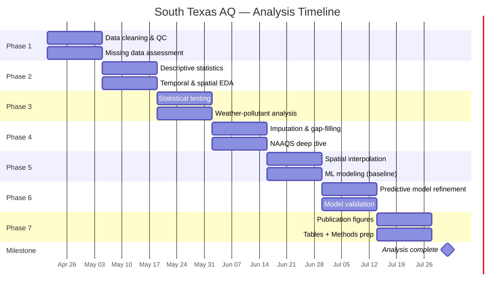

# 16 — Analysis Project Timeline & Deliverables

> **Goal:** Complete all data analysis for the South Texas Air Quality
> manuscript by **August 1, 2026**, ready for writing.
>
> **Team:** Aidan Meyers (AM) · Manassa Kuchavaram (MK) · PI: Dr. Rajesh Melaram
>
> **Timeline:** April 21 – August 1, 2026 (~15 weeks)
>
> **Tools:** Google Colab (primary) → Neon Postgres (SQL queries) → pipeline parquet store (local heavy lifting)

---

## Phase overview

---

## Week-by-week deliverables

### Week 1 — April 21–25: Data Cleaning & Quality Control (Part 1)

| Task | Lead | Deliverable |
|---|:---:|---|
| Audit hourly completeness rates per site per year — identify sites with <50% coverage | **AM** | Completeness heatmap (site × year), saved as figure |
| Flag and document measurement outliers (negative values, physically impossible concentrations) per pollutant group | **MK** | Outlier report CSV + summary table |
| Verify ozone unit normalization is correct by spot-checking 5 TCEQ sites against raw files | **AM** | Verification log in notebook |
| Document which sites have concurrent EPA + TCEQ observations (SO₂ value conflicts) — quantify agreement | **MK** | Conflict summary table |

### Week 2 — April 28 – May 2: Data Cleaning & Quality Control (Part 2)

| Task | Lead | Deliverable |
|---|:---:|---|
| Build and run automated QC flags: negative values, spike detection (>3σ from rolling mean), stuck sensors (zero-variance runs >24h) | **AM** | QC-flagged parquet or CSV with a `qc_flag` column |
| Assess wind data quality — check for stuck wind directions, calm-wind thresholds, anemometer failures | **MK** | Wind QC summary per station |
| Produce a master data availability matrix: pollutant × site × year → % valid hours | **AM** | Publication-quality figure |
| Document all QC decisions and exclusion criteria for the Methods section | **MK** | Methods paragraph draft (QC subsection) |

### Week 3 — May 5–9: Descriptive Statistics

| Task | Lead | Deliverable |
|---|:---:|---|
| Compute per-pollutant summary statistics (mean, median, P5, P25, P75, P95, max, σ) by county and year | **AM** | Summary statistics table (all pollutants, publication-ready) |
| Generate box/violin plots of pollutant distributions by county, season, and year | **MK** | 6–8 publication-quality figures |
| Compute diurnal profiles (mean hourly concentration by hour-of-day) for O₃, NO₂, PM₂.₅ at the 5 highest-traffic sites | **AM** | Diurnal profile plots |
| Rank sites by annual mean concentration for each pollutant — identify hotspots | **MK** | Ranked site table per pollutant |

### Week 4 — May 12–16: Temporal Trend Analysis

| Task | Lead | Deliverable |
|---|:---:|---|
| Time series plots of monthly mean concentration (2015–2025) for each pollutant at each county | **AM** | Multi-panel time series figures |
| Seasonal decomposition (STL or similar) for O₃ and PM₂.₅ at Bexar, Nueces, Cameron | **MK** | Decomposition plots (trend + seasonal + residual) |
| Year-over-year NAAQS design value trend at all ozone sites — does the trend support or contradict nonattainment trajectory? | **AM** | Trend figure + interpretive paragraph |
| Identify and document episodic events (wildfire smoke, Saharan dust, industrial incidents) visible in the daily data | **MK** | Episode catalog table (date, county, pollutant, magnitude, probable cause) |

### Week 5 — May 19–23: Spatial Pattern Analysis

| Task | Lead | Deliverable |
|---|:---:|---|
| Site-level maps of annual-mean pollutant concentrations (scatter on lat/lon) for 2020–2024 | **AM** | Spatial maps per pollutant per year |
| Compute inter-site correlations (Pearson/Spearman) for O₃ and PM₂.₅ — how well do nearby sites agree? | **MK** | Correlation matrix heatmap |
| Urban-rural gradient analysis: compare Bexar (urban) vs. Atascosa/Karnes/Wilson (rural) for NO₂ and CO | **AM** | Gradient comparison figure + significance test results |
| Coastal vs. inland PM₂.₅ comparison (Nueces/Cameron vs. Bexar/Comal) | **MK** | Comparison box plots + Mann-Whitney U test results |

### Week 6 — May 26–30: Weather–Pollutant Relationships

| Task | Lead | Deliverable |
|---|:---:|---|
| Correlation analysis: daily pollutant means vs. daily weather variables (temp, humidity, wind speed, pressure, GHI) | **AM** | Correlation matrix figures per pollutant group |
| Conditional distributions: ozone on hot days (>35°C) vs. cool days (<25°C); PM₂.₅ on high-humidity vs. low-humidity days | **MK** | Conditional density plots |
| Wind-direction analysis: pollutant concentration roses for Bexar and Nueces industrial sites | **AM** | Pollution-rose figures |
| Rainfall washout effect: PM₂.₅ before/after rain events | **MK** | Before/after comparison table + figure |

### Week 7 — June 2–6: Statistical Hypothesis Testing

| Task | Lead | Deliverable |
|---|:---:|---|
| Mann-Kendall trend tests + Sen's slope estimator for annual O₃, PM₂.₅, NO₂ at each site | **AM** | Table of slopes + p-values per site-pollutant pair |
| Kruskal-Wallis / Dunn's post-hoc for seasonal differences in each pollutant at each county | **MK** | Seasonal significance table |
| Paired comparison of weekday vs. weekend concentrations for NO₂ and CO (traffic signal) | **AM** | Weekday/weekend comparison figure + Wilcoxon test |
| Test PM₂.₅ annual means against the revised 9.0 µg/m³ NAAQS — which site-years formally exceed? | **MK** | Exceedance table with confidence intervals |

### Week 8 — June 9–13: Imputation & Gap-Filling

| Task | Lead | Deliverable |
|---|:---:|---|
| Evaluate imputation strategies for missing hourly data: linear interpolation, seasonal LOCF, kNN-based, multiple imputation | **AM** | Comparative imputation performance table (MAE, RMSE on held-out 10% of observed data) |
| Implement chosen imputation method and apply to gaps ≤48 hours across all pollutants | **MK** | Imputed dataset (parquet) with `imputed` flag column |
| Sensitivity analysis: do NAAQS design values change after imputation vs. raw (NA-dropped)? | **AM** | Before/after NAAQS comparison table |
| Document imputation approach for Methods section — justify choice of method + gap threshold | **MK** | Methods paragraph draft (imputation subsection) |

### Week 9 — June 16–20: NAAQS Compliance Deep Dive

| Task | Lead | Deliverable |
|---|:---:|---|
| Compute 3-year rolling design values (the formal NAAQS compliance metric) for O₃ and PM₂.₅ across all applicable sites | **AM** | 3-year design value table + trend figure |
| Compare our computed design values against EPA's published values (https://www.epa.gov/air-trends/air-quality-design-values) — quantify agreement | **MK** | Cross-validation table with % difference per site |
| Exceedance-day analysis: for each O₃ exceedance day, what were the weather conditions? Build a "typical exceedance day" profile | **AM** | Exceedance-day weather profile table + figure |
| Draft the NAAQS results narrative for the manuscript Results section | **MK** | ~500-word draft |

### Week 10 — June 23–27: Spatial Interpolation (Kriging / IDW)

| Task | Lead | Deliverable |
|---|:---:|---|
| Implement ordinary kriging for annual-mean O₃ across the 13-county study area using the `pykrige` library | **AM** | Kriged surface map (O₃ annual mean, 2023) |
| Implement IDW (inverse distance weighting) as a comparison baseline | **MK** | IDW surface map (same parameter/year) |
| Cross-validation: leave-one-out for both kriging and IDW — which has lower prediction error? | **AM** | LOO-CV error table |
| Repeat for PM₂.₅ annual mean; assess whether the sparser PM₂.₅ network limits interpolation quality | **MK** | PM₂.₅ kriged surface + error analysis |

### Week 11 — June 30 – July 4: Machine Learning Baseline Models

| Task | Lead | Deliverable |
|---|:---:|---|
| Feature engineering: build a daily modeling dataset with pollutant targets + weather predictors + calendar features (DOW, month, holiday, season) | **AM** | Feature-engineered DataFrame saved to parquet |
| Train Random Forest regressors for daily O₃ and PM₂.₅ prediction at each site, using weather as input | **MK** | RF model performance table (R², RMSE, MAE per site) |
| Feature importance analysis: which weather variables dominate pollutant prediction? | **AM** | Feature importance bar charts per pollutant |
| Train XGBoost as a second model family for the same targets — compare to RF | **MK** | Model comparison table (RF vs. XGBoost) |

### Week 12 — July 7–11: Model Refinement & Validation

| Task | Lead | Deliverable |
|---|:---:|---|
| Spatial cross-validation: train on N-1 sites, predict the held-out site — assess transferability | **AM** | Spatial-CV error table per site |
| Temporal cross-validation: train on 2015–2022, predict 2023–2024 — assess forecast skill | **MK** | Temporal-CV forecast error plots |
| Hyperparameter tuning (grid search or Optuna) for the best-performing model | **AM** | Tuned model parameters + improvement over baseline |
| SHAP analysis for model interpretability — which features drive high vs. low predictions? | **MK** | SHAP summary plots per pollutant |

### Week 13 — July 14–18: Publication Figures (Part 1)

| Task | Lead | Deliverable |
|---|:---:|---|
| Finalize all time series and trend figures to publication standard (consistent fonts, colors, axes, captions) | **AM** | Figures 1–4 (trends, seasonality, diurnal profiles) |
| Finalize all spatial maps to publication standard (basemaps, scale bars, north arrows, legends) | **MK** | Figures 5–7 (site maps, kriged surfaces, prediction maps) |
| Build a comprehensive NAAQS summary figure (heatmap: site × year, color = % of standard) | **AM** | Figure 8 (NAAQS heatmap) |
| Build a weather-driven analysis figure (multi-panel: correlation matrix + conditional densities + wind roses) | **MK** | Figure 9 (weather–pollutant relationships) |

### Week 14 — July 21–25: Publication Figures (Part 2) + Tables

| Task | Lead | Deliverable |
|---|:---:|---|
| Build final model performance comparison figure (bar chart: R², RMSE across model types and pollutants) | **AM** | Figure 10 (model comparison) |
| Build SHAP / feature importance composite figure | **MK** | Figure 11 (model interpretability) |
| Compile Table 1: Study area characteristics (counties, sites, date coverage, populations) | **AM** | Table 1 LaTeX/Word |
| Compile Table 2: Summary statistics by pollutant and county | **MK** | Table 2 LaTeX/Word |
| Compile Table 3: NAAQS design values + exceedance summary | **AM** | Table 3 LaTeX/Word |
| Compile Table 4: Model performance summary | **MK** | Table 4 LaTeX/Word |

### Week 15 — July 28 – August 1: Methods Finalization & Handoff

| Task | Lead | Deliverable |
|---|:---:|---|
| Assemble complete Methods section from weekly paragraph drafts | **AM** | Methods section final draft |
| Assemble complete Results section outline with figure/table references | **MK** | Results section outline |
| Final QC pass on all figures — consistent formatting, correct units, no rendering artifacts | **AM** | Verified figure set (PNG + PDF) |
| Final QC pass on all tables — cross-check numbers against pipeline outputs | **MK** | Verified table set |
| Package all analysis notebooks into a reproducible Colab collection | **AM + MK** | Shared Colab folder with numbered notebooks |

!!! success "Milestone: August 1, 2026 — Analysis Complete"

    All figures, tables, and Methods/Results drafts ready for manuscript
    assembly. The writing phase begins.

---

## Task status tracker

Use this table to track completion. Update directly in this markdown
file (edit on GitHub or locally) — the docs site will rebuild on push.

| Week | Dates | AM status | MK status | Notes |
|:---:|---|:---:|:---:|---|
| 1 | Apr 21–25 | ⬜ | ⬜ | |
| 2 | Apr 28–May 2 | ⬜ | ⬜ | |
| 3 | May 5–9 | ⬜ | ⬜ | |
| 4 | May 12–16 | ⬜ | ⬜ | |
| 5 | May 19–23 | ⬜ | ⬜ | |
| 6 | May 26–30 | ⬜ | ⬜ | |
| 7 | Jun 2–6 | ⬜ | ⬜ | |
| 8 | Jun 9–13 | ⬜ | ⬜ | |
| 9 | Jun 16–20 | ⬜ | ⬜ | |
| 10 | Jun 23–27 | ⬜ | ⬜ | |
| 11 | Jun 30–Jul 4 | ⬜ | ⬜ | |
| 12 | Jul 7–11 | ⬜ | ⬜ | |
| 13 | Jul 14–18 | ⬜ | ⬜ | |
| 14 | Jul 21–25 | ⬜ | ⬜ | |
| 15 | Jul 28–Aug 1 | ⬜ | ⬜ | |

**Legend:** ⬜ Not started · 🟡 In progress · ✅ Complete · ❌ Blocked

---

## Delegation philosophy

The split above alternates tasks so that:

1. **Both AM and MK touch every analytical domain** (no single points
   of failure — if one person is unavailable, the other has context).
2. **AM leans toward infrastructure-heavy tasks** (pipeline QC, feature
   engineering, kriging implementation, figure finalization) given his
   role as lead pipeline developer.
3. **MK leans toward statistical/interpretive tasks** (outlier reports,
   significance testing, model comparison, narrative drafting) to
   build manuscript-ready outputs directly.
4. **Modeling work is explicitly shared** (AM: RF + kriging, MK: XGBoost
   + IDW + SHAP) so both contribute to the ML story.

If the balance needs adjusting (e.g., one person has coursework
obligations in June), swap tasks within a week — the deliverables
stay the same, just the lead changes.

---

## Dependencies between phases

Each phase depends on the previous one's outputs. If a phase runs
ahead of schedule, start pulling tasks from the next phase. If a
phase falls behind, flag it in the status tracker and discuss
rebalancing with PI.
