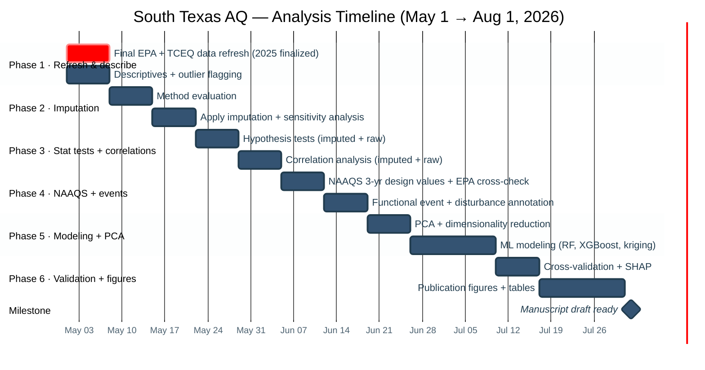

# 16 — Analysis Project Timeline & Deliverables

> **Goal:** Complete all data analysis for the South Texas Air Quality
> manuscript by **August 1, 2026**, ready for writing.
>
> **Team:** Aidan Meyers (AM) · Manassa Kuchavaram (MK) · PI: Dr. Rajesh Melaram
>
> **Timeline:** May 1 – August 1, 2026 (~13 weeks)
>
> **Tools:** Google Colab (primary) → Neon Postgres (SQL queries) → pipeline parquet store (local heavy lifting)

---

## Phase overview



!!! tip "Click the Gantt chart to enlarge"

    Mermaid diagrams in this docs site are SVG — zoom with browser
    Ctrl+scroll, or right-click → "Open image in new tab" for a
    full-screen view. The timeline is also mirrored in the
    week-by-week sections below where every cell is searchable.

---

## Week-by-week deliverables

Each week is collapsible. Click to expand. Use the status checkboxes
in the tracker at the bottom to mark progress — edit the markdown
directly on GitHub (`pipeline/docs/16_project_timeline.md`), commit,
and the docs site rebuilds in ~2 minutes.

??? example "Week 1 — May 1–9 · Final data refresh + Descriptive statistics"

    !!! warning "This week is the hard data freeze"

        Pull the **final** EPA AQS Data Mart and TCEQ TAMIS extracts
        for 2025-complete. After this week, no new raw data enters
        the pipeline before manuscript submission. Every analysis from
        Phase 2 onward locks against the v0.3.5 data tranche.

    | Task | Lead | Deliverable |
    |---|:---:|---|
    | Pull EPA AQS Data Mart 2025-complete (all 13 counties, all parameters) and stage under `!Final Raw Data/EPA AQS Downloads/` | **AM** | Refreshed master CSV + commit reference |
    | Pull TCEQ TAMIS 2025-complete extracts for the 14 TCEQ sites | **AM** | Refreshed `*.txt` files in `!Final Raw Data/TCEQ Data - Missing Sites/` |
    | Re-run upstream reorg scripts to refresh `By_Pollutant/*.csv` | **AM** | Updated merged CSVs |
    | Re-run `pipeline/run_pipeline.py` end-to-end (~30 min) | **AM** | Updated parquet store + Postgres |
    | Compute per-pollutant summary statistics (mean, median, P5, P25, P75, P95, max, σ) by county and year | **MK** | Summary statistics table (publication-ready) |
    | Generate box/violin plots of pollutant distributions by county, season, and year | **MK** | 6–8 publication-quality figures |
    | Compute diurnal profiles (mean hourly concentration by hour-of-day) for O₃, NO₂, PM₂.₅ at 5 highest-loaded sites | **AM** | Diurnal profile plots |
    | Outlier detection + flagging (negative values, physically impossible spikes, zero-variance runs >24 h) | **MK** | Outlier report CSV + `qc_flag` column proposal |
    | Audit hourly completeness rates per site per year — completeness heatmap (site × year) | **AM** | Completeness heatmap figure |
    | Initial week 1 report posted to dashboard repo | **AM + MK** | First entry in week-by-week reports site |

??? example "Week 2 — May 12–16 · Imputation method evaluation"

    Imputation is **required** for many of the temporal models and
    analyses in later weeks. We evaluate methods this week, then
    commit to one in Week 3.

    | Task | Lead | Deliverable |
    |---|:---:|---|
    | Build a held-out evaluation set: artificially mask 10% of observed values across pollutants/sites/seasons | **AM** | Held-out mask + ground truth |
    | Evaluate linear interpolation (baseline for short gaps ≤6 h) | **MK** | MAE, RMSE per pollutant |
    | Evaluate seasonal LOCF (last observation carried forward, season-aware) | **MK** | MAE, RMSE per pollutant |
    | Evaluate kNN-based imputation (using site neighbors + weather) | **AM** | MAE, RMSE per pollutant |
    | Evaluate multiple imputation by chained equations (MICE, `miceforest` package) | **AM** | MAE, RMSE per pollutant |
    | Pick the winner per gap-length bucket (≤6 h, 6–24 h, 24–48 h, >48 h) and document rationale | **MK** | Methods paragraph draft (imputation subsection) |
    | Week 2 dashboard report | **AM + MK** | Posted to dashboard repo |

??? example "Week 3 — May 19–23 · Apply imputation + sensitivity analysis"

    | Task | Lead | Deliverable |
    |---|:---:|---|
    | Apply chosen imputation methods to gaps ≤48 h across all pollutants and weather | **AM** | Imputed parquet store with `imputed` flag column |
    | Apply chosen weather imputation for missing meteorological values | **MK** | Imputed weather parquet |
    | Re-compute daily aggregates and NAAQS values from the imputed dataset | **AM** | Imputed `pollutant_daily` + `naaqs_design_values` (separate Postgres tables, e.g. `aq.pollutant_daily_imputed`) |
    | Sensitivity analysis: how much do annual means + NAAQS design values change after imputation vs. raw NA-dropped? | **MK** | Before/after comparison table + figure |
    | Document imputation approach for Methods section, including gap-length thresholds | **MK** | Methods paragraph (final) |
    | Week 3 dashboard report | **AM + MK** | Posted |

??? example "Week 4 — May 26–30 · Statistical hypothesis testing"

    Run all tests **twice**: once on the raw NA-dropped data, once on
    the imputed data. Differences between the two are themselves
    informative (often noted in Results / Discussion).

    | Task | Lead | Deliverable |
    |---|:---:|---|
    | Mann-Kendall trend tests + Sen's slope estimator for annual O₃, PM₂.₅, NO₂ at each active site (raw + imputed) | **AM** | Slopes + p-values per site-pollutant pair (paired tables) |
    | Kruskal-Wallis / Dunn's post-hoc for seasonal differences in each pollutant at each county (raw + imputed) | **MK** | Seasonal significance tables (paired) |
    | Paired weekday vs. weekend comparison for NO₂ and CO (traffic signal); Wilcoxon test | **AM** | Weekday/weekend comparison figure + test results |
    | PM₂.₅ annual means vs. revised 9.0 µg/m³ NAAQS — formal exceedance test with confidence intervals (raw + imputed) | **MK** | Exceedance table |
    | Week 4 dashboard report | **AM + MK** | Posted |

??? example "Week 5 — June 2–6 · Correlation analysis"

    | Task | Lead | Deliverable |
    |---|:---:|---|
    | Inter-pollutant correlations within each county (Pearson + Spearman, raw + imputed) | **AM** | Correlation matrix heatmaps |
    | Pollutant-weather correlations (daily means vs. temp, humidity, wind, GHI, pressure) — raw + imputed | **MK** | Correlation matrix figures per pollutant group |
    | Inter-site correlations for O₃ and PM₂.₅ — how well do nearby sites agree? | **AM** | Inter-site correlation matrix |
    | Lagged correlation analysis: does today's weather predict tomorrow's pollutant level? | **MK** | Lagged correlation tables + figure |
    | Document statistical/correlational findings for Methods + Results | **AM + MK** | ~500-word Methods paragraph + Results outline |
    | Week 5 dashboard report | **AM + MK** | Posted |

??? example "Week 6 — June 9–13 · NAAQS deep dive + 3-year design values"

    | Task | Lead | Deliverable |
    |---|:---:|---|
    | Compute 3-year rolling design values (formal NAAQS compliance metric) for O₃ and PM₂.₅ | **AM** | 3-year design value tables + trend figures |
    | Compare our computed design values against EPA's published values; quantify agreement per site | **MK** | Cross-validation table with % difference |
    | Identify all sites in formal nonattainment (3-yr O₃ > 0.070 ppm, 3-yr PM₂.₅ > 9.0 µg/m³) for any year | **AM** | Nonattainment-site catalog |
    | Time series plots of 3-year rolling NAAQS values (2017–2025) per site | **MK** | Multi-panel time series |
    | Week 6 dashboard report | **AM + MK** | Posted |

??? example "Week 7 — June 16–20 · Functional event & disturbance annotation"

    For every confirmed exceedance day or unusually high pollutant
    episode, annotate the probable cause: wildfire smoke, Saharan
    dust intrusion, industrial event, refinery flare, port activity,
    holiday-related (e.g. fireworks PM₂.₅), etc.

    | Task | Lead | Deliverable |
    |---|:---:|---|
    | Build a candidate-events list: every site-day where any pollutant exceeded its NAAQS or local 95th percentile | **AM** | Candidate events table (CSV) |
    | Cross-reference with NIFC wildfire database, NOAA Saharan dust forecasts, TCEQ industrial incident reports | **MK** | Annotated events catalog with probable cause column |
    | Build a "typical exceedance day" weather profile (temp, wind, mixing height) by event type | **AM** | Profile table + figure |
    | Document the events catalog as a supplementary table for the manuscript | **MK** | Final supplementary table draft |
    | Week 7 dashboard report | **AM + MK** | Posted |

??? example "Week 8 — June 23–27 · PCA + dimensionality reduction"

    | Task | Lead | Deliverable |
    |---|:---:|---|
    | PCA across the daily pollutant + weather feature space — how many components explain 80%/95% of variance? | **AM** | Scree plot + variance-explained figure |
    | Identify pollutant groupings via the loading matrix (which pollutants co-vary?) | **MK** | Loading-matrix heatmap |
    | Site-level PCA biplot — cluster sites by pollutant signature | **AM** | Biplot figure with site labels |
    | Optional: NMF or t-SNE for non-linear comparison | **MK** | Comparison figure if results warrant |
    | Week 8 dashboard report | **AM + MK** | Posted |

??? example "Week 9 — June 30 – July 4 · ML modeling part 1 (Random Forest + XGBoost)"

    | Task | Lead | Deliverable |
    |---|:---:|---|
    | Feature engineering: build a daily modeling dataset (pollutant targets + weather + calendar features) | **AM** | Feature parquet |
    | Train Random Forest regressors for daily O₃ and PM₂.₅ at each site | **MK** | RF performance table (R², RMSE, MAE per site) |
    | Train XGBoost on the same targets; compare to RF | **AM** | Model comparison table |
    | Feature importance analysis (RF + XGBoost) — which weather variables dominate? | **MK** | Importance bar charts per pollutant |
    | Week 9 dashboard report | **AM + MK** | Posted |

??? example "Week 10 — July 7–11 · ML modeling part 2 (kriging + spatial interpolation)"

    | Task | Lead | Deliverable |
    |---|:---:|---|
    | Implement ordinary kriging for annual O₃ across the 13-county area (`pykrige`) | **AM** | Kriged surface map |
    | Implement IDW as comparison baseline | **MK** | IDW surface map |
    | Cross-validation: leave-one-out for both methods — which has lower error? | **AM** | LOO-CV error table |
    | Repeat for PM₂.₅ — assess whether sparser PM₂.₅ network limits interpolation quality | **MK** | PM₂.₅ kriged surface + error analysis |
    | Week 10 dashboard report | **AM + MK** | Posted |

??? example "Week 11 — July 14–18 · Model validation"

    | Task | Lead | Deliverable |
    |---|:---:|---|
    | Spatial cross-validation: train on N-1 sites, predict the held-out one — assess transferability | **AM** | Spatial CV error table |
    | Temporal cross-validation: train on 2015–2022, predict 2023–2024 — assess forecast skill | **MK** | Temporal CV forecast plots |
    | Hyperparameter tuning (Optuna) for the best-performing model family | **AM** | Tuned params + improvement over baseline |
    | SHAP analysis for model interpretability | **MK** | SHAP summary plots per pollutant |
    | Week 11 dashboard report | **AM + MK** | Posted |

??? example "Week 12 — July 21–25 · Publication figures part 1"

    | Task | Lead | Deliverable |
    |---|:---:|---|
    | Finalize all time series + trend figures (consistent fonts, colors, axes, captions) | **AM** | Figures 1–4 |
    | Finalize all spatial maps (basemaps, scale bars, north arrows, legends) | **MK** | Figures 5–7 |
    | NAAQS summary heatmap (site × year, color = % of standard) | **AM** | Figure 8 |
    | Weather-driven analysis composite figure | **MK** | Figure 9 |
    | Week 12 dashboard report | **AM + MK** | Posted |

??? example "Week 13 — July 28 – August 1 · Publication figures part 2 + Methods finalization"

    | Task | Lead | Deliverable |
    |---|:---:|---|
    | Model performance comparison figure (bar chart: R², RMSE across model types and pollutants) | **AM** | Figure 10 |
    | SHAP / feature importance composite | **MK** | Figure 11 |
    | Compile Tables 1–4 (study area, summary stats, NAAQS exceedance, model performance) | **AM + MK** | LaTeX/Word tables |
    | Assemble complete Methods section from weekly drafts | **AM** | Methods final |
    | Assemble Results section outline with figure/table refs | **MK** | Results outline |
    | Final QC pass on all figures + tables | **AM + MK** | Verified set |
    | Final week 13 dashboard report + handoff checklist | **AM + MK** | Posted |

!!! success "Milestone: August 1, 2026 — Analysis Complete"

    All figures, tables, and Methods/Results drafts ready for
    manuscript assembly. Writing phase begins.

---

## Live status tracker

Edit this table directly on GitHub (`pipeline/docs/16_project_timeline.md`)
to keep the dashboard current. Push any commit and the docs site rebuilds
within 2 minutes.

| Phase | Week | Dates | AM | MK | Notes |
|:---:|:---:|---|:---:|:---:|---|
| 1 | 1 | May 1–9 | ⬜ | ⬜ | Hard data freeze week |
| 2 | 2 | May 12–16 | ⬜ | ⬜ | Imputation eval |
| 2 | 3 | May 19–23 | ⬜ | ⬜ | Imputation apply |
| 3 | 4 | May 26–30 | ⬜ | ⬜ | Hypothesis tests (raw + imputed) |
| 3 | 5 | June 2–6 | ⬜ | ⬜ | Correlations |
| 4 | 6 | June 9–13 | ⬜ | ⬜ | 3-yr NAAQS design values |
| 4 | 7 | June 16–20 | ⬜ | ⬜ | Event annotation |
| 5 | 8 | June 23–27 | ⬜ | ⬜ | PCA |
| 5 | 9 | June 30–July 4 | ⬜ | ⬜ | RF + XGBoost |
| 5 | 10 | July 7–11 | ⬜ | ⬜ | Kriging + IDW |
| 6 | 11 | July 14–18 | ⬜ | ⬜ | CV + SHAP |
| 6 | 12 | July 21–25 | ⬜ | ⬜ | Figures part 1 |
| 6 | 13 | July 28–Aug 1 | ⬜ | ⬜ | Figures part 2 + Methods |

**Legend:** ⬜ Not started · 🟡 In progress · ✅ Complete · ❌ Blocked

---

## Weekly report dashboard (separate repository)

Every week, Aidan + Manassa post a structured report to a dedicated
results-and-reports repository:

> **Repo (planned):** `https://github.com/AidanJMeyers/south-texas-aq-results`
> **Site:** `https://aidanjmeyers.github.io/south-texas-aq-results/`
> *(to be created when Week 1 reports are ready)*

### Format for each weekly report

Each `week-NN-MM-DD.md` file in that repo follows this structure:

```markdown
# Week N — <date range> · <phase name>

## What we did
- Bullet list of completed tasks (cross-reference timeline doc 16)

## Key results
- Headline figures, tables, statistics

## Code blocks
- The actual SQL / Python that produced the results
- Links to the Colab notebook(s) that ran them

## Decisions made / assumptions
- Anything that locks future work (e.g. "We chose MICE for imputation
  because X, Y, Z; this means the modeling phase assumes...")

## Open questions / blockers
- For PI review

## Next week preview
```

### Why a separate repo?

- Keeps **pipeline code** clean and stable in this repo (publish once)
- **Reports change rapidly** week-to-week — separate change history
- Reports site can be **public** without exposing the pipeline's
  evolution; pipeline site can stay focused on protocol documentation
- Both rebuild via the same MkDocs + GitHub Pages flow
- Site members navigate between them via cross-links

### Future: GIS dashboard

Once weekly reports are flowing (after ~Week 4), Aidan will spin up a
third repo for an interactive GIS dashboard — kriged surface maps, site
markers with hover-to-query pollutant time series, exceedance overlays,
etc. Likely tech: Leaflet + a small Python/Flask backend pulling from
the Neon authenticated Data API.

---

## Delegation philosophy

The split above alternates tasks so that:

1. **Both AM and MK touch every analytical domain** — no single
   points of failure. If one is unavailable, the other has context.
2. **AM leans toward infrastructure-heavy tasks** (data refresh,
   feature engineering, kriging, figure finalization, ML training)
   given his role as lead pipeline developer.
3. **MK leans toward statistical/interpretive tasks** (outlier
   reports, significance testing, model comparison, narrative
   drafting, event annotation) to build manuscript-ready outputs
   directly.
4. **Modeling work is explicitly shared** so both contribute to the
   ML story.

If the balance needs adjusting (e.g. coursework obligations in June),
swap tasks within a week — deliverables stay the same, only the lead
changes.

---

## Phase dependency diagram

```mermaid
%%{init: {'theme':'base','themeVariables':{'fontFamily':'Arial'}}}%%
flowchart LR
    classDef phase fill:#FFFFFF,stroke:#213c4e,stroke-width:2px,color:#213c4e,font-weight:600
    classDef hard  fill:#FDEBD3,stroke:#c2410c,stroke-width:2.5px,color:#7c2d0b,font-weight:700
    classDef done  fill:#e8f5e9,stroke:#2e7d32,stroke-width:2px,color:#1b5e20,font-weight:600

    P0["Pipeline engineering<br/>(complete)"]
    P1["Week 1<br/>Refresh + Descriptives"]
    P2["Weeks 2–3<br/>Imputation"]
    P3["Weeks 4–5<br/>Tests + Correlations"]
    P4["Weeks 6–7<br/>NAAQS + Events"]
    P5["Weeks 8–10<br/>PCA + ML + Kriging"]
    P6["Weeks 11–13<br/>Validation + Figures"]
    DONE["Aug 1<br/>Manuscript-ready"]

    P0 --> P1 --> P2 --> P3 --> P4 --> P5 --> P6 --> DONE

    class P0 done
    class P1 hard
    class P2,P3,P4,P5,P6 phase
    class DONE done
```



Each phase depends on the previous one's outputs. If a phase runs
ahead, start pulling tasks from the next. If a phase falls behind,
flag it in the status tracker and discuss rebalancing with the PI.
