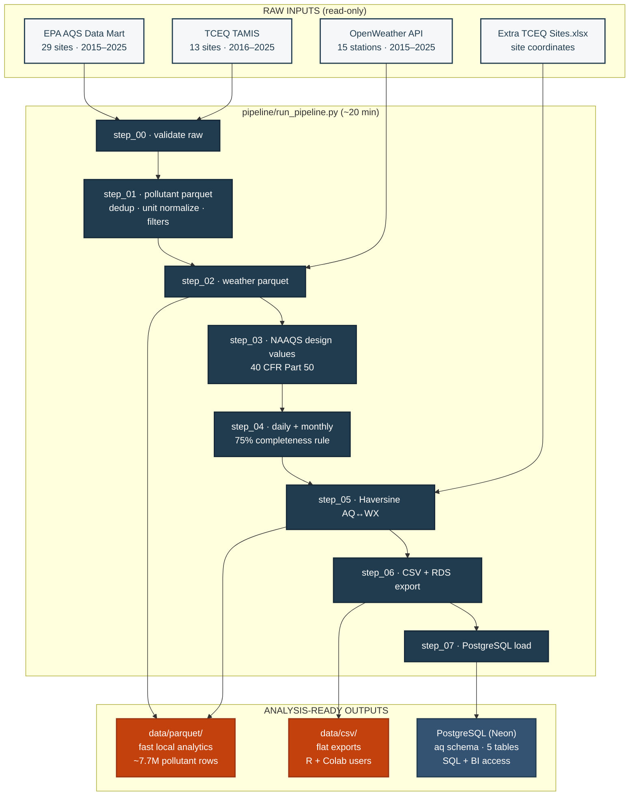

---
hide:
  - toc
---

# South Texas Air Quality Data Pipeline

<span class="brand-badge">Melaram Lab</span>
<span class="brand-badge brand-badge-accent">v0.3.4</span>

!!! info "About this project"

    A reproducible, config-driven data pipeline assembling, validating,
    normalizing, and analyzing ambient air quality data for
    **13 South Texas counties** over **2015–2025**.

    **Lab:** Melaram Lab, Texas A&M University–Corpus Christi
    **Lead:** Aidan Wolf
    **Contact:** [www.melaramlab.com](https://www.melaramlab.com)
    **License:** MIT

## Pipeline schematic



!!! abstract "At-a-glance numbers"

    | Count | What |
    |---:|---|
    | **42** | Active monitoring sites with in-scope data |
    | **13** | South Texas counties covered |
    | **15** | OpenWeather stations used for meteorological pairing |
    | **7.7M** | Hourly pollutant rows in parquet (post-dedup + filters) |
    | **1.47M** | Hourly weather rows in parquet |
    | **764** | NAAQS design values computed (9 metrics × 40 sites × 11 years) |
    | **~20 min** | End-to-end pipeline runtime on a laptop SSD |

## :material-download: Download the pipeline inputs

!!! warning "You need ~2 GB of raw data before you can run the pipeline"

    The git repository ships with the **pipeline code** only. To actually
    run it, you need the raw EPA AQS, TCEQ TAMIS, and OpenWeather files
    that live under `!Final Raw Data/` and `01_Data/` in the project tree.
    These are too large to commit to git.

### OneDrive bundle (for Melaram Lab members)

<a href="https://onedrive.live.com/REPLACE_WITH_SHARE_LINK" class="download-cta">
  :material-microsoft-onedrive: Download pipeline inputs from OneDrive
</a>

The OneDrive share contains a single zip file `south-texas-aq-inputs.zip`
(~2 GB) with this exact layout:

```
south-texas-aq-inputs/
├── !Final Raw Data/
│   ├── EPA AQS Downloads/
│   │   ├── AQS_SouthTexas_2015_2025_COMPLETE.csv
│   │   ├── by_pollutant/
│   │   └── individual_downloads/
│   ├── TCEQ Data - Missing Sites/
│   └── Extra TCEQ Sites.xlsx
└── 01_Data/
    ├── Processed/
    │   ├── By_Pollutant/
    │   ├── By_County/
    │   └── Meteorological/
    └── Reference/
        └── enhanced_monitoring_sites.csv
```

**To install:**

```powershell
# 1. Clone the code repo
git clone https://github.com/AidanJMeyers/south-texas-aq-pipeline.git
cd south-texas-aq-pipeline

# 2. Download the OneDrive zip into the repo root and unzip it
#    (both "!Final Raw Data/" and "01_Data/" should land next to pipeline/)
Expand-Archive south-texas-aq-inputs.zip -DestinationPath .

# 3. Install dependencies and run
pip install -r requirements.txt
python pipeline/run_pipeline.py
```

!!! note "OneDrive access is currently restricted to Melaram Lab members."

    If you're an external collaborator and need access, email
    [BREATHE-CC@tamucc.edu](mailto:BREATHE-CC@tamucc.edu) with your
    affiliation and intended use.

---

## Get started in 30 seconds

Already have the data downloaded? Pick your tool:

=== "Python users"

    ```python
    import pandas as pd
    dv = pd.read_csv("data/csv/naaqs_design_values.csv")
    # Sites exceeding the 8-hr ozone NAAQS in 2023
    print(dv.query("metric == 'ozone_8hr_4th_max' and year == 2023 and exceeds"))
    ```

    Full guide → [Python usage](./07_usage_python.md)

=== "R / RStudio users"

    ```r
    library(data.table)
    dv <- fread("data/csv/naaqs_design_values.csv")
    dv[metric == "ozone_8hr_4th_max" & year == 2023 & exceeds == TRUE]
    ```

    Full guide → [R usage](./08_usage_r.md)

=== "SQL / BI users"

    ```sql
    SELECT county_name, site_name, value
    FROM aq.naaqs_design_values
    WHERE metric = 'ozone_8hr_4th_max' AND year = 2023 AND exceeds = TRUE
    ORDER BY value DESC;
    ```

    Full guide → [SQL usage](./10_usage_sql.md)

=== "Google Colab users"

    ```python
    from google.colab import drive
    drive.mount('/content/drive')
    import os, pandas as pd
    os.chdir('/content/drive/MyDrive/AirQuality South TX')
    dv = pd.read_csv('data/csv/naaqs_design_values.csv')
    ```

    Full guide → [Colab usage](./09_usage_colab.md)

---

## Navigate the docs

<div class="grid cards" markdown>

-   :material-map-marker-radius: **Project**

    ---

    [Overview](./01_overview.md) · [Data sources](./02_data_sources.md) · [Schemas](./03_data_schemas.md) · [Architecture](./04_pipeline_architecture.md)

-   :material-flask: **Methodology**

    ---

    [NAAQS formulas & completeness rules](./05_methodology.md) · [Known data quality issues](./06_data_quality.md)

-   :material-code-tags: **Usage guides**

    ---

    [Python](./07_usage_python.md) · [R / RStudio](./08_usage_r.md) · [Google Colab](./09_usage_colab.md) · [SQL / Postgres](./10_usage_sql.md)

-   :material-chef-hat: **Recipes**

    ---

    [15 — Recipes & worked examples](./15_recipes.md) — copy-paste queries for common research tasks

-   :material-cog: **Operations**

    ---

    [Reproducibility](./11_reproducibility.md) · [Config reference](./12_configuration_reference.md) · [Architecture decisions](./13_decisions.md)

-   :material-school: **Publication**

    ---

    [Methods-section protocol](./14_publication_protocol.md) · [CITATION.cff](./CITATION.cff)

</div>

---

## Pipeline version history

| Version | Date | Summary |
|---|---|---|
| 0.3.4 | 2026-04-15 | MkDocs site with GitHub Pages deployment + Melaram Lab branding |
| 0.3.3 | 2026-04-15 | Calaveras Lake TCEQ feed filter, Calaveras Lake Park excluded (TSP-only) |
| 0.3.2 | 2026-04-15 | CC Palm VOCs raw data ingested (1 → 2 active VOC sites) |
| 0.3.1 | 2026-04-15 | Site registry correction, data provenance fixes |
| 0.3.0 | 2026-04-14 | Initial publication-grade docs suite; 47-site registry with status tags |
| 0.2.1 | 2026-04-14 | Ozone unit mismatch fix (EPA ppm vs TCEQ ppb) |
| 0.2.0 | 2026-04-13 | PostgreSQL loader added (Neon free tier) |
| 0.1.0 | 2026-04-13 | Initial pipeline release (parquet store + NAAQS computation) |

---

<div style="text-align: center; margin-top: 3em; color: #555555;">
  <strong>Melaram Lab</strong> · Texas A&amp;M University–Corpus Christi
  <br/>
  <a href="https://www.melaramlab.com">www.melaramlab.com</a>
  ·
  <a href="https://github.com/AidanJMeyers/south-texas-aq-pipeline">GitHub</a>
</div>
